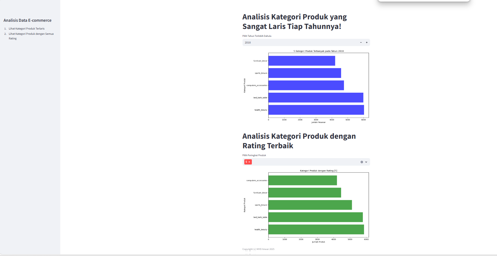

# E-Commerce Data Analysis Using Python

## 1. Memilih Dataset
Dataset yang digunakan adalah [E-Commerce Public Dataset](https://drive.google.com/file/d/1MsAjPM7oKtVfJL_wRp1qmCajtSG1mdcK/view) dari Brazil (Olist), yang memuat berbagai informasi transaksi dari penjual dan pembeli, termasuk data order, produk, review, pembayaran, dan lokasi.

## 2. Melakukan Seluruh Proses Analisis Data

### Pertanyaan Bisnis
1. **Kategori produk apa yang paling banyak mendapatkan review baik dan kurang baik dari pembeli?**  
2. **Produk apa yang paling laris dan kurang laris di E-commerce?**  
3. **Pada tahun 2018, kategori produk apa yang paling banyak diminati pembeli?**  
4. **Pendapatan tertinggi terjadi pada tahun berapa?**

### Proses Analisis:
Dilakukan secara menyeluruh, dimulai dari:
- **Pengumpulan data:** Menggabungkan 9 dataset seperti `orders`, `products`, `order_items`, `order_reviews`, dsb.
- **Pembersihan data:** Menangani duplikasi, missing values, dan penyesuaian tipe data.
- **Eksplorasi data:** Menggabungkan tabel untuk menjawab pertanyaan bisnis.
- **Visualisasi:** Menggunakan `matplotlib` dan `seaborn` untuk membuat grafik yang menjawab pertanyaan.

### Hasil Visualisasi & Insight
- **Review Terbanyak:** Produk dengan kategori `bed_bath_table` memiliki review paling banyak, namun `cool_stuff` mendapatkan nilai bintang tertinggi.
- **Produk Terlaris:** Produk dari kategori `health_beauty` dan `sports_leisure` paling laris dijual, sedangkan beberapa kategori seperti `cds_dvds_musicals` jarang diminati.
- **Tahun 2018:** Produk kategori `bed_bath_table` paling diminati selama tahun 2018.
- **Pendapatan Tertinggi:** Pendapatan tertinggi terjadi pada tahun **2018**, yang ditampilkan dalam bentuk bar chart berdasarkan `order_purchase_timestamp`.

## 3. Menyusun Notebook secara Terstruktur
Notebook telah disusun rapi dengan bagian:
- Identitas & Pertanyaan Bisnis
- Import library dan dataset
- Data Wrangling (pembersihan & penggabungan)
- Exploratory Data Analysis
- Visualisasi
- Kesimpulan

## 4. Dashboard Streamlit  


> **Dashboard ini dibangun menggunakan Streamlit**, yang menampilkan hasil analisis data e-commerce secara interaktif dan informatif. Beberapa fitur utama dalam dashboard ini meliputi:

#### Fitur Utama:

1. **Visualisasi 5 Kategori Produk Terlaris per Tahun**  
   Pengguna dapat memilih tahun tertentu, dan dashboard akan menampilkan lima kategori produk dengan jumlah pesanan terbanyak.

2. **Visualisasi Kategori Produk dengan Rating Terbaik**  
   Pengguna dapat memfilter berdasarkan skor rating produk (misalnya rating 4), dan melihat kategori produk dengan jumlah tertinggi pada rating tersebut.

3. **Filter Interaktif**  
   Tersedia dropdown untuk memilih **tahun** dan **rating**, sehingga pengguna non-teknis dapat mengeksplorasi data dengan mudah sesuai kebutuhan mereka.

## Installation
1. Clone this repository to your local machine:
```
https://github.com/anwarJIHAD/E-Commerce-Data-Analysis-Python.git
```
2. Go to the project directory
```
cd E-Commerce-Data-Analysis-Python
```
3. Install the required Python packages by running:
```
pip install -r requirements.txt
```

## Usage
1. **Data Wrangling**: Data wrangling scripts are available in the `notebook.ipynb` file to prepare and clean the data.

2. **Exploratory Data Analysis (EDA)**: Explore and analyze the data using the provided Python scripts. EDA insights can guide your understanding of e-commerce public data patterns.

3. **Visualization**: Run the Streamlit dashboard for interactive data exploration:

```
cd data-analyst-python/dashboard
streamlit run .\Streamlit\main.py
```
Access the dashboard in your web browser at `http://localhost:8501`.

